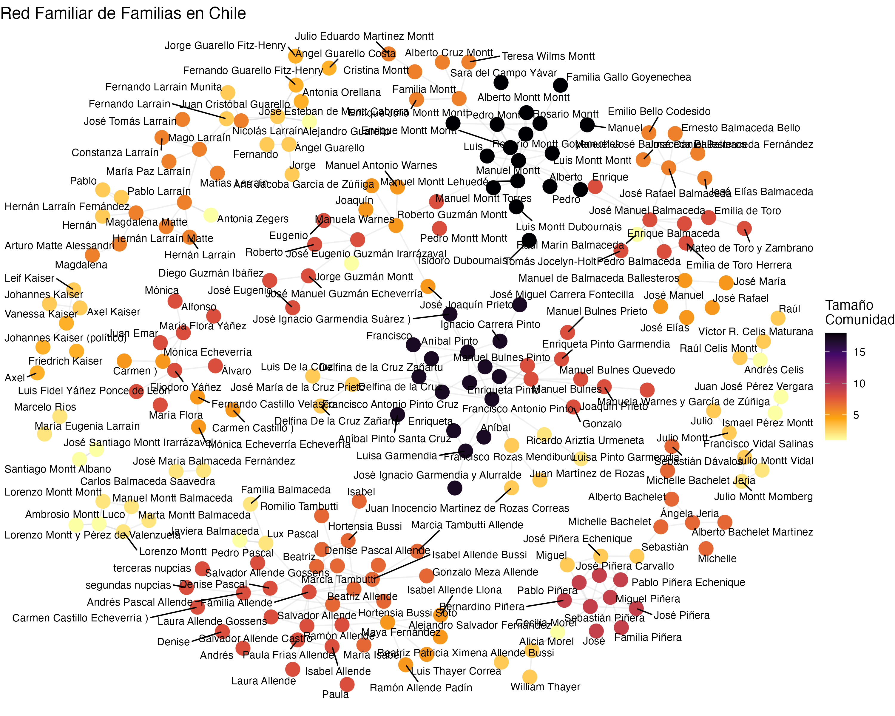

# Redes y reproducción de la elite chilena.  Aproximación desde Wikipedia

¿Te sorprendería si te digo que existe un relación clara entre el Mio Cid Campeador y Vicente Huidobro? ¿Y Atahualpa y Piñera?

El presente proyecto busca describir las redes y estrategias de reproducción de la elite chilena en Wikipedia. Para ello, se utilizarán técnicas de análisis de redes sociales y minería de texto para analizar los artículos de Wikipedia relacionados con la elite chilena y su historia.

